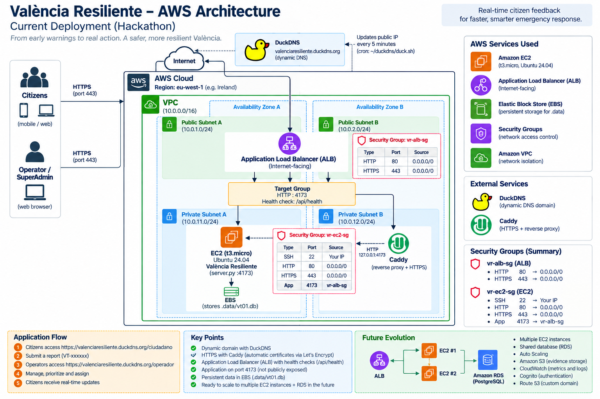

# 🚨 València Resiliente

Plataforma de resiliencia urbana desarrollada para un hackathon, diseñada para mejorar la comunicación entre ciudadanía y operadores durante situaciones de emergencia.

La aplicación permite que la ciudadanía comunique rápidamente su situación y que los operadores puedan visualizar, priorizar, asignar y gestionar las incidencias en tiempo real.

---

## 🎯 Objetivo

El objetivo de **València Resiliente** es reducir el tiempo entre:

```text
Ciudadanía
    ↓
Comunicación de necesidad
    ↓
Clasificación y priorización
    ↓
Operador
    ↓
Respuesta
```

Cada incidencia genera un identificador único:

```text
VT-xxxxxx
```

---

## 👤 Portal Ciudadano

Disponible en:

```text
/ciudadano
```

El ciudadano puede indicar:

- Si ha recibido una alerta.
- Si ha entendido la alerta.
- Si puede actuar.
- Si necesita ayuda.
- Número de personas afectadas.
- Ubicación o zona.
- Información adicional sobre la incidencia.

Una vez enviada la información, el backend crea una incidencia identificada como:

```text
VT-xxxxxx
```

---

## 🧑‍💻 Portal Operador

Disponible en:

```text
/operador
```

El operador puede:

- Visualizar incidencias.
- Consultar ubicación y zona.
- Consultar número de personas afectadas.
- Establecer prioridades.
- Asignar incidencias.
- Cambiar el estado.
- Enviar instrucciones.
- Realizar seguimiento.

---

## 🔄 Flujo de funcionamiento

```text
1. Ciudadano accede a /ciudadano

                ↓

2. Comunica su situación

                ↓

3. Backend genera VT-xxxxxx

                ↓

4. La incidencia aparece en /operador

                ↓

5. El operador analiza la situación

                ↓

6. Prioriza y asigna

                ↓

7. Envía instrucciones

                ↓

8. El ciudadano recibe la actualización
```

---

# ☁️ Arquitectura AWS



## Arquitectura actual

```text
                    INTERNET
                       │
          ┌────────────┴────────────┐
          │                         │
          ▼                         ▼
       DuckDNS                   AWS ALB
          │                         │
       HTTPS                        │
          │                         │
        Caddy                       │
          │                         │
          └────────► EC2 ◄──────────┘
                     │
                  :4173
                     │
                     ▼
               SQLite / EBS
```

---

## Servicios utilizados

### Amazon EC2

La aplicación se ejecuta sobre una instancia:

```text
Ubuntu 24.04
Python
server.py
Puerto 4173
```

---

### Amazon EBS

Utilizado para almacenar los datos persistentes de la aplicación.

Actualmente la aplicación utiliza:

```text
SQLite
.data/vt01.db
```

---

### Application Load Balancer

AWS Application Load Balancer se utiliza como punto de entrada hacia la aplicación.

Flujo:

```text
Internet
   ↓
Application Load Balancer
   ↓
Target Group
   ↓
EC2 :4173
```

El Target Group utiliza el endpoint:

```text
GET /api/health
```

para comprobar el estado de la aplicación.

> Actualmente existe una única EC2 registrada como target.
>
> Por tanto, el ALB proporciona health checks y deja preparada la arquitectura
> para escalado horizontal, pero todavía no existe reparto real de carga entre
> múltiples instancias.

---

### AWS Security Groups

Los Security Groups controlan el tráfico hacia la infraestructura.

El puerto de aplicación:

```text
4173
```

no debe exponerse directamente a Internet.

El tráfico hacia este puerto está limitado al Security Group del Application Load Balancer.

---

### DuckDNS

DuckDNS proporciona un dominio dinámico para acceder a la demo.

```text
valenciaresiliente.duckdns.org
```

---

### Caddy

Caddy se utiliza como:

```text
HTTPS
+
Reverse Proxy
```

Flujo:

```text
Internet
   ↓
DuckDNS
   ↓
HTTPS
   ↓
Caddy
   ↓
127.0.0.1:4173
   ↓
Aplicación
```

---

# 🔐 Seguridad

El backend incorpora diferentes mecanismos de seguridad:

- Autenticación.
- Gestión de sesiones.
- Roles.
- Protección CSRF.
- Control de acceso.
- Idempotencia mediante `clientRequestId`.
- HTTPS.
- Security Groups.
- Separación entre tráfico público y puerto interno de aplicación.

Los secretos y datos sensibles no forman parte del repositorio.

Nunca deben almacenarse en GitHub:

```text
*.pem
*.key
.data/
*.db
tokens
contraseñas
.env
```

---

# ⚙️ Ejecución local

## Requisitos

```text
Python 3.9+
Node.js (solo para validaciones JavaScript)
Navegador moderno
```

Ejecutar:

```bash
python3 server.py serve \
  --host 127.0.0.1 \
  --port 4173
```

Después abrir:

```text
http://127.0.0.1:4173
```

Ciudadano:

```text
http://127.0.0.1:4173/ciudadano
```

Operador:

```text
http://127.0.0.1:4173/operador
```

---

# ❤️ Health Check

La aplicación dispone del endpoint:

```text
GET /api/health
```

Prueba local:

```bash
curl http://127.0.0.1:4173/api/health
```

Respuesta esperada:

```json
{
  "ok": true
}
```

---

# 🧪 Tests

## Validar sintaxis Python

```bash
python3 -m py_compile server.py
```

## Tests backend

```bash
python3 -m unittest -v tests/test_server.py
```

## Comprobar JavaScript

```bash
node --check public/assets/citizen-api.js
```

```bash
node --check public/assets/operator-app.js
```

---

# 🛠 Mejoras realizadas

Durante el despliegue se han realizado diferentes mejoras técnicas.

### Compatibilidad con proxies y ALB

La aplicación puede obtener la IP original del cliente utilizando:

```text
X-Forwarded-For
```

Esto permite trabajar correctamente detrás de proxies y load balancers.

### Health checks

Se incorporó:

```text
/api/health
```

para permitir monitorización y health checks desde AWS.

### Ejecución mediante systemd

La aplicación se ejecuta como servicio:

```text
valencia-resiliente.service
```

permitiendo:

- Inicio automático.
- Reinicio ante fallos.
- Logs centralizados.
- Ejecución persistente.

---

# 📂 Estructura del proyecto

```text
valencia-resiliente/
│
├── server.py
├── README.md
├── .gitignore
│
├── public/
│   ├── index.html
│   ├── ciudadano.html
│   ├── operador.html
│   └── assets/
│
├── tests/
│   └── test_server.py
│
├── infra/
│   ├── caddy/
│   ├── systemd/
│   └── duckdns/
│
├── docs/
│   └── aws-architecture.png
│
└── .github/
    └── workflows/
```

---

# 🚀 Arquitectura futura

El siguiente paso sería sustituir SQLite por una base de datos compartida.

```text
SQLite
   ↓
Amazon RDS PostgreSQL
```

Esto permitiría desplegar varias instancias:

```text
                 Internet
                    │
                    ▼
                   ALB
              ┌─────┴─────┐
              ▼           ▼
           EC2 #1       EC2 #2
              │           │
              └─────┬─────┘
                    ▼
            Amazon RDS
            PostgreSQL
```

Esto permitiría implementar balanceo real y escalado horizontal.

---

## 🔮 Roadmap

- Amazon RDS PostgreSQL.
- Varias instancias EC2.
- Auto Scaling.
- Amazon S3 para evidencias.
- Amazon CloudWatch.
- AWS Systems Manager / Secrets Manager.
- Amazon Cognito.
- Route 53.
- AWS Certificate Manager.
- Backups automatizados.

---

# 🏆

València Resiliente transforma un prototipo local en una plataforma desplegada
en AWS, accesible desde Internet y preparada para evolucionar hacia una
arquitectura distribuida y escalable.

**De la ciudadanía a la respuesta.  
Tecnología para una València más resiliente.**
