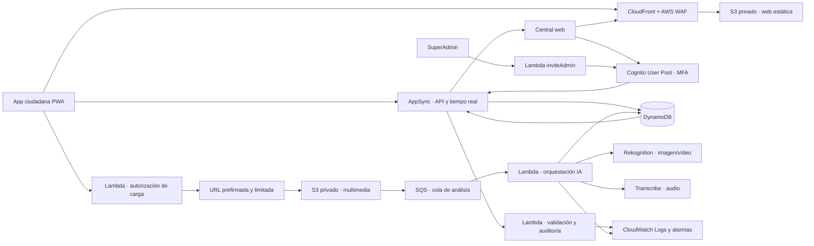

# Paso de la demo local a AWS

La cuenta Free Plan de AWS permite construir una prueba de concepto durante un máximo de seis meses o hasta agotar sus créditos, lo que ocurra antes. La elegibilidad concreta de cada servicio debe comprobarse en Billing antes del despliegue.

## Correspondencia con lo que ya funciona

| Demo local | AWS para el piloto |
|---|---|
| `public/*.html` | S3 privado distribuido por CloudFront |
| API Python | AppSync y funciones Lambda |
| SQLite | DynamoDB con cifrado administrado |
| Sesión local | Cognito User Pool para la central |
| Roles `SuperAdmin` / `Operator` | Grupos de Cognito y comprobación del rol en cada operación |
| Alta local de usuarios | Lambda `inviteAdmin` con `AdminCreateUser`, solo para `SuperAdmin` |
| Consulta cada 2,5 s | Suscripciones de AppSync y recuperación de cambios tras reconectar |
| Multimedia local privada | Carga directa a S3 mediante URL prefirmada; objeto privado, cifrado y caducidad |
| Análisis local `simulated` | Cola SQS y Lambda; Rekognition para imagen/vídeo y Transcribe para audio |
| Revisión humana local | Mutación AppSync con identidad Cognito, rol y auditoría inmutable |

## Orden de implementación

1. Crear el presupuesto y las alertas de coste antes de los recursos.
2. Publicar las dos webs en S3 privado con CloudFront y HTTPS.
3. Crear Cognito con registro público desactivado, grupos `SuperAdmin` y `Operator`, MFA para la central y un usuario inicial creado por consola.
4. Crear tablas separadas para `Incident`, `IncidentEvent`, `AlertResponse` y `AuditEvent`.
5. Llevar el contrato JSON ya usado por `citizen-api.js` y `operator-app.js` a AppSync.
6. Añadir suscripciones por incidencia y por central. Tras reconectar, consultar los cambios posteriores a la última versión conocida.
7. Incorporar multimedia en un bucket distinto del sitio, sin acceso público, con URL prefirmada, cifrado, caducidad y control de tipo y tamaño. La autorización debe estar ligada al identificador del caso y a un nombre de objeto generado por el servidor.
8. Desplegar `inviteAdmin` con permiso mínimo para `AdminCreateUser` y asignación de grupo; nunca conceder esas acciones al navegador.
9. Enviar los eventos de S3 a SQS. Una Lambda consume la cola, llama al servicio adecuado según el tipo de archivo y escribe resultado, proveedor, versión, confianza y motivos en DynamoDB.
10. Publicar el resultado mediante AppSync. La interfaz lo debe etiquetar como `REAL` únicamente cuando proviene del proveedor configurado; un fallo o timeout queda como `SIN ANALIZAR`, nunca como prioridad baja.
11. Mantener la confirmación, cambio o rechazo por parte del operador antes de usar la sugerencia en una decisión operativa.
12. Añadir CloudWatch, trazas de auditoría, alarmas de cola bloqueada, presupuesto y una prueba de restauración.

Para el piloto hay que mantener `clientRequestId`, `id`, `serverReceivedAt` y `version`: son los campos que evitan duplicados y permiten afirmar que el aviso llegó al servidor. La interfaz ciudadana no debe mostrar “recibido” antes de obtener ese acuse real.

## Controles de seguridad y privacidad

- La app pública no recibe credenciales de AWS. Solicita al backend una URL de carga de corta duración y alcance único.
- El bucket multimedia bloquea acceso público, usa cifrado, conserva versiones solo durante el periodo acordado y elimina objetos por una regla de ciclo de vida.
- La precisión de ubicación se minimiza según el uso: zona para el check-in colectivo y coordenada exacta solo para una incidencia individual con consentimiento.
- La central usa MFA y permisos separados para `SuperAdmin` y `Operator`. Toda apertura de evidencia y toda revisión quedan auditadas.
- La respuesta de IA es una señal asistida. El panel conserva la fuente, el modelo, la versión, la confianza y la intervención humana.
- Los contenidos sensibles no se usan para entrenar modelos y deben alojarse en la región y bajo las condiciones acordadas por la ciudad.

## Mantenerse dentro del presupuesto de la demo

CloudFront, S3, DynamoDB, Lambda, AppSync, Cognito y CloudWatch deben tener límites y alarmas desde el primer día. El análisis multimedia puede generar coste por uso aunque el resto del prototipo entre en créditos o cuotas gratuitas. Para el hackathon se puede mantener `mode: simulated`, activar análisis real solo para un conjunto pequeño de archivos y fijar concurrencia reservada de Lambda, retención corta y una alarma de presupuesto. La consola de Billing de la cuenta concreta es la fuente válida para saber qué créditos y cuotas siguen disponibles.

Fuentes oficiales: [AWS Free Tier](https://aws.amazon.com/free/free-tier-faqs/), [Amazon Cognito User Pools](https://docs.aws.amazon.com/cognito/latest/developerguide/cognito-user-pools.html), [grupos de Cognito](https://docs.aws.amazon.com/cognito/latest/developerguide/cognito-user-pools-user-groups.html) y [tiempo real de AppSync](https://docs.aws.amazon.com/appsync/latest/devguide/aws-appsync-real-time-data.html).
