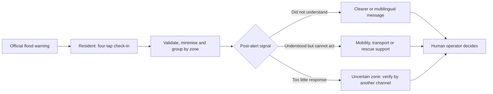

# VT Return Signal - Miro answers

Copy-ready answers for City Resilience Hack 2026. Working name: **VT Return Signal**.

## Evidence key

- **Confirmed evidence:** documented fact, observed prototype behaviour or direct stakeholder feedback.
- **Prototype evidence:** demonstrated in the current local MVP, but not yet proven in a live emergency.
- **Assumption:** plausible but still requires validation.
- **To complete:** the team must add a real name, date, measurement or mentor quote. Do not present placeholders as evidence.

## Scope lock

- **One situation:** a flood alert affecting a residential area in Valencia.
- **Primary user:** an emergency coordination operator or incident commander responsible for prioritising limited resources.
- **Data-contributing user:** a resident in the affected zone who has received the warning.
- **One decision:** which zone needs communication support, evacuation assistance or verification first.
- **Core distinction:** "did not understand" requires communication; "understood but cannot act" requires operational support.
- **Working decision:** **ADAPT** the current prototype around this single story.

# SPRINT 1 - SOLUTION DEVELOPMENT & VALIDATION

## 01 - THE PROBLEM

### Our idea in one sentence

> We help Valencia emergency coordination operators identify, within minutes of a flood alert, which zones contain people who understood the warning but cannot act, by turning a 15-second citizen check-in into privacy-preserving zone priorities and recommended actions.

### What is the problem?

Valencia can detect hazards and send public warnings, but after an alert is transmitted the operator lacks a rapid, structured picture of whether affected residents received it, understood it and can follow it. A warning can be technically delivered while a person remains unable to evacuate because of reduced mobility, lack of transport, dependants, language, medication needs or isolation.

The 29 October 2024 DANA is the concrete case behind the project. The team document records that ES-Alert reached phones at 20:11, after flooding had already begun inland. It also records 237 deaths, with provisional regional data indicating that about 47% of recorded deaths were in ground-floor homes or garages and close to half of victims were over 70. This supports the problem statement that receiving an instruction is not the same as being able to execute it.

### How is it handled today?

The documented current system is mainly one-way: hazard monitoring and ES-Alert communicate the warning, while information about residents' real ability to act arrives later through 112 calls, field reports, police and fire crews, social services, relatives and informal channels. These sources are valuable but can be delayed, duplicated and difficult to compare by area. **This operational description still needs confirmation from a named Valencia service representative.**

### Who is the user?

The primary user is the **emergency coordination operator or incident commander** who must decide where to send scarce teams, vehicles and adapted communication. The citizen supplies the return signal but the operational value is delivered when the operator can make a faster, better-supported decision.

### Why does it matter?

Existing warning systems answer "was a warning transmitted?" VT Return Signal aims to answer the next operational question: **"Can the people in this zone actually do what we asked?"** Without that answer, silence can be mistaken for safety and communication problems can be confused with mobility or transport problems.

## 02 - OUR SOLUTION

### How does it help?

It gives the operator a post-alert human-capability layer. Residents make a short structured check-in. The service minimises and groups responses by zone, separates comprehension from capability, identifies the main barriers, marks low-response areas as uncertain and recommends the next operational action.

### What makes it better?

- It complements ES-Alert and 112 instead of replacing them.
- It measures response capability rather than repeating hazard detection.
- It distinguishes a communication need from a physical assistance need.
- It treats silence as uncertainty, never as proof that an area is safe.
- It uses explainable rules for the MVP instead of an opaque prediction model.
- It shows aggregate zone signals by default and separates any identifiable rescue request into a consent-based assistance path.

### USER SITUATION

A flood warning has been sent to a residential area. The operator has one rescue team available and must decide whether to reinforce the message, arrange assisted evacuation or verify an area from which almost nobody has responded.

### SOLUTION INTERACTION

Residents open a secure link and answer four taps: warning received, instruction understood, able to act, and main barrier/support need. With consent, a one-time location assigns the response to a zone. The system validates the submission, aggregates it, attaches freshness and confidence information, and updates the operator view.

### RESULT / BENEFIT

The operator sees that one zone understood the alert but cannot move because of mobility and transport barriers, while another zone has too little response data to interpret. The system recommends different actions for each: operational assistance for the first and verification or an alternative communication channel for the second.

## 03 - SHOW THE SOLUTION

### Three-step storyboard

| Step | What the resident/operator sees | What they do | What they receive |
|---|---|---|---|
| 1. Check in | A mobile screen linked from a simulated flood alert | The resident answers four structured questions in under 15 seconds and optionally shares one-time zone location | A server-confirmed receipt and clear safety instruction |
| 2. Turn responses into a signal | The system validates, minimises and groups responses | No manual action; rules separate comprehension, capability, barrier and silence | A fresh zone-level signal with count, coverage, confidence and source |
| 3. Prioritise action | The operator sees three zones on a map and ranked cards | The operator opens the highest-priority zone, verifies the evidence and selects the next action | A recommended action: reinforce communication, send mobility/transport support, or verify an uncertain silent zone |

### 60-second demo narrative

1. A resident receives a simulated flood alert and selects **"I understand, but I cannot evacuate - mobility"**.
2. The central dashboard updates and the affected zone changes priority. The operator sees the response count, freshness, verification state and dominant barrier.
3. The operator selects **"request verification"** or **"assign assisted evacuation"**. The resident view receives the acknowledgement or instruction.

### What should the viewer understand?

> The city already knows about the flood and can send the warning. VT Return Signal shows whether people can act on it and what kind of response the zone needs.

## 04 - CITY VALIDATION

### Is this a real need in your city?

**Partially confirmed.** The historical case and warning research support the need. The working materials also contain direct feedback from a Valencia fire-service conversation that reports should be verified before operational action. The remaining critical point - whether aggregate zone data would change resource deployment - has not yet been confirmed by a named operator in a recorded test.

### Direct stakeholder feedback available

> "I'd add call verification. It's standard practice to verify the call from the other end, to confirm that the person calling is actually there and that the case is real."

- **What this confirms:** provenance and verification matter before a report can justify dispatch.
- **What this challenges:** a colour or anonymous citizen report alone is not enough for a high-consequence decision.
- **What should change:** show source, freshness, verification status and confidence; keep the operator in control of dispatch.

### City representative / role / date

**[TO COMPLETE: full name] / Valencia Fire Department [TO COMPLETE: exact role] / [TO COMPLETE: interview date]**

### Source / stakeholder

Valencia Fire Department working-session note supplied by the team. Confirm the speaker, role, date and permission to quote before the pitch.

### Still missing from city validation

- The minimum response count or confidence level needed to use a zone signal.
- Whether an operator would redirect a real crew based on the dashboard.
- The acceptable geographic precision: zone, street, building or exact point.
- How long data remains operationally useful: 5, 15 or 30 minutes.
- Which existing 112, fire or Civil Protection workflow should receive the signal.
- Which information is unnecessary or too sensitive.
- Which degraded-connectivity path fits current procedures.

## 05 - WHAT WE LEARNED

### Confirmed by evidence

- **Case evidence:** the DANA material shows that a sent warning did not guarantee timely protective action, especially for older people and people in exposed ground-floor locations.
- **Research evidence:** the documented Protective Action Decision Model separates reception, attention and comprehension before action is even considered.
- **Stakeholder evidence:** fire-service feedback requires verification of citizen-originated reports.
- **Prototype evidence:** the citizen and control views can exchange an incident, server receipt, status and instruction through one API and persistent database.
- **Design evidence:** the interface can visibly separate "not understood" from "cannot act" and can mark silence as uncertain.

### Still an assumption

- Enough residents will respond during a stressful event to create a representative zone signal.
- A four-tap check-in can be completed in under 15 seconds by people of different ages and abilities.
- Zone-level information will change an operator's allocation of crews or communication resources.
- The proposed ranking rule - blocked responses first, silence second, contextual vulnerability as a tie-breaker - matches operational priorities.
- A minimum aggregation threshold can protect privacy without hiding urgent information.
- A secure link can be added to an official alert or existing municipal channel.
- The proposed pilot costs and benefits are realistic.

### Next critical test

Run a 20-minute tabletop test with one Valencia emergency operator or fire officer. Present the same simulated flood first with the current information and then with three VT zone signals. Ask the participant to allocate one available team in each version. Record:

1. whether the decision changes;
2. which data caused the change;
3. the minimum count/confidence required;
4. which item would be ignored or could cause a false alarm.

This is the smallest test that addresses the main uncertainty: **does the signal change an operational decision?**

### What would enable a pilot?

- A named city sponsor and operational owner.
- Agreement that VT is advisory and complements existing command systems.
- A defined alert trigger, selected zone and test population.
- An approved verification and escalation procedure.
- A data-protection impact assessment, lawful basis, consent language, retention rule and minimum aggregation threshold.
- Accessibility and multilingual testing, including older residents.
- Production HTTPS, identity management, audit logging, monitoring and recovery.
- A degraded-connectivity fallback and a no-network test.
- A tabletop or controlled exercise before any live emergency use.

## 06 - OUR DECISION

### Decision

**ADAPT**

Keep the return-signal concept and working two-sided demo. Adapt the story and product surface to one Valencia flood scenario, one operator decision and four citizen signals. Separate aggregate situational awareness from individual rescue assistance.

### What will change?

- Lead with **comprehension vs capability**, not a general incident-reporting app.
- Make the default operator view aggregate by zone.
- Always label low response as **uncertain / insufficient data**, never green or safe.
- Add source, timestamp, freshness, response count and verification state to every operational signal.
- Keep exact location, media and live tracking only in a separate explicit-consent rescue flow.
- Hide weather, news, advanced video, drones, digital twins and responder wellbeing from the 60-second core demo; position them as later modules.
- State clearly which device and city integrations are simulated.

### Next action + owner + proposed deadline

| Action | Owner | Proposed deadline (Tallinn time) |
|---|---|---|
| Run and record one operational tabletop test; capture an attributable quote | Gabriela | 24 Sep 2026, 20:00 |
| Lock the four-tap flow, zone states and real/simulated labels in the demo | Lino | 25 Sep 2026, 10:00 |
| Replace broad future vision with one pilot, metrics and transparent cost assumptions | Roop | 25 Sep 2026, 12:00 |
| Final pitch QA, embedded media check and upload-ready export | Team | 25 Sep 2026, 14:45 |

# SPRINT 2 - MVP DEVELOPMENT

## 01 - DEFINE THE MVP

### Our MVP in one sentence

> A mobile citizen check-in and operator dashboard that turn post-alert responses into verified, time-stamped zone priorities and one recommended next action.

### Who is the first user?

The primary decision user is a Valencia emergency coordination operator managing a flood alert. The first data-contributing user is a resident in the selected zone who may be unable to evacuate without help.

### The core user task

Within five minutes of a simulated alert, the operator identifies the zone with the highest unmet response need, understands why, checks confidence and chooses a next action.

### What can the user do in the MVP?

- Resident: respond without creating an account; indicate understanding, capability, barrier and support need; optionally share one-time zone location; receive confirmation and an operator instruction.
- Operator: authenticate; see new responses on a map and queue; distinguish communication from mobility/transport needs; inspect freshness and verification; prioritise, verify, assign and send an instruction.

### Critical assumption to test

Zone-level post-alert data, with visible coverage and confidence, changes or confirms an operator's resource-priority decision quickly enough to matter.

### Must include

- One flood scenario and one end-to-end demo path.
- Four-tap, no-account check-in targeted below 15 seconds.
- Server-confirmed receipt and duplicate prevention.
- Comprehension vs capability and structured barrier tagging.
- Zone aggregation with response count, freshness and minimum threshold.
- Silence shown as uncertainty.
- Explainable ranking and one recommended action.
- Verification/provenance status.
- One degraded-connectivity behaviour.
- Clear privacy and emergency-service boundaries.

### Can wait

- Live video.
- Continuous GPS.
- Drone feeds and computer vision.
- Predictive AI and digital twins.
- Automated dispatch.
- Multi-incident analytics and long-term trend reporting.
- Care-home and responder-wellbeing modules.

### Outside the scope for now

- Replacing 112, ES-Alert, Alertes IV or municipal command systems.
- Triggering an official public warning.
- Making an autonomous dispatch decision.
- Tracking all residents or displaying identifiable people in the analytics layer.
- Diagnosing physical or mental-health conditions.
- Claiming production readiness or city-wide scale.

## 02 - MAP THE SERVICE JOURNEY

| Stage | User action | What the user sees | What happens behind the scenes | Responsible |
|---|---|---|---|---|
| 1. DISCOVER / ACCESS | Resident opens a secure link from a simulated flood alert; operator signs into the control panel | Plain-language alert context, official 112 boundary, language/accessibility controls | Incident and questionnaire version load; no citizen account is created; operator access is authenticated | City communications for the invitation; VT platform for access; city IT for identity |
| 2. START / REQUEST | Resident answers received/understood/can-act/barrier and consents to one-time zone location if desired | Four large choices, minimal text and a visible send action | Input validation, data minimisation, idempotency key and server acknowledgement; a rescue request is routed separately from aggregate analytics | Resident; VT platform; 112/fire service owns rescue-channel procedures |
| 3. RECEIVE / USE | Operator opens the updated zone and compares priorities | Map, response count, coverage, age, verification state, dominant barrier and recommended action | Responses are assigned to a zone, aggregated above a minimum threshold and ranked by explainable rules; silence remains uncertain | VT platform computes; operator interprets; incident commander decides |
| 4. COMPLETE / FOLLOW UP | Operator verifies/assigns/sends an instruction; resident confirms status or updates it | Citizen sees acknowledgement and instruction; operator sees audit trail and latest status | Status is synchronised, action is logged, stale data is downgraded and raw data expires according to incident policy | Operator and command structure; platform records; city closes incident |

## 03 - BUILD & SHOW THE SOLUTION

### What are we showing?

A resident uses a phone to submit one post-alert check-in. The central dashboard receives it, updates the affected Valencia zone and explains why its priority changed. The operator requests verification or sends an assistance instruction, which appears on the citizen view.

### What should the viewer understand in 60 seconds?

The useful innovation is not another warning. It is the return signal that differentiates **message failure**, **action barrier** and **unknown silence**, early enough for an operator to choose a different response.

### Which parts are real in the current prototype?

- Two browser interfaces connected to the same API and persistent SQLite database.
- Server-confirmed incident creation, unique case reference and duplicate protection.
- Operator authentication, roles and administrator creation.
- Queue, Valencia map, status, priority, verification, assignment and instructions.
- Citizen-to-central submission and central-to-citizen status/instruction synchronisation.
- Retry after connection loss without creating a duplicate case.
- Spanish, Valencian and English interface support.

### Which parts are simulated or incomplete?

- Official ES-Alert/Alertes IV trigger and secure link.
- Arrival and verification of a real 112 telephone call.
- Device camera capture, media upload and live video transport.
- Device GPS in the current demo; displayed coordinates are synthetic.
- Official weather, traffic, social feed and live city data.
- Real dispatch/CAD integration, city identity provider and production-scale hosting.
- Large-scale aggregation denominators and validated confidence thresholds.

### What still needs to be developed?

- A true 15-second post-alert check-in aligned with the four-signal framework.
- Privacy threshold and zone aggregation enforced by the backend, not only described in the UI.
- Real device geolocation and photo upload with explicit consent, secure storage and retention.
- A separate rescue-mode data path.
- Confidence, verification, provenance and stale-data rules agreed with operators.
- Server-side enforcement of the verification sequence; the current interface guides the operator, but the backend does not yet require a callback before a case is marked confirmed.
- Persistent citizen follow-up messages, status deterioration updates, photo requests and location withdrawal after the first submission.
- Separation of synthetic seed figures from live test responses, with zero-baseline datasets for measured validation.
- Automated retention/deletion; the 24-hour expiry shown in the interface is currently a proposed policy rather than a running deletion job.
- Production cloud identity, monitoring, backup, recovery and security review.
- Integration adapter for an official alert and command workflow.

## 04 - TEST THE MVP

### Who will test it?

1. One Valencia fire officer, emergency coordinator or Civil Protection operator.
2. At least five residents, including one person over 70 and one person using an accessibility need or language other than Spanish.

### What task will they try?

- Resident: after reading a simulated flood alert, submit the correct status and barrier without help.
- Operator: with one team available, identify the first zone to address, explain why and choose the next action.

### What will we observe?

- Completion time, errors, abandoned steps and misunderstood labels.
- Whether comprehension and capability are interpreted correctly.
- Time to identify the priority zone.
- Which count, freshness and confidence level the operator requires.
- Whether the recommended action is accepted, changed or ignored.
- Whether silence is correctly treated as uncertainty.

### What would count as success?

- Median citizen completion time at or below 15 seconds.
- At least 4 of 5 residents complete without facilitator help.
- The operator identifies the intended priority zone within 60 seconds.
- The operator can explain the ranking in one sentence.
- The operator states that the additional signal would change or confirm a real action.
- No low-response zone is interpreted as safe.
- No unauthorised individual identity is exposed in the aggregate view.

### Feedback received so far

The direct feedback available asks for **call/report verification** before trusting the source. The prototype has therefore added a verification workflow, but the operational threshold and responsible role still require validation.

### What will we change?

Use the test result to remove any field the operator would not act on, set the minimum useful freshness and confidence, and rewrite any citizen choice that takes longer than 15 seconds or is misunderstood.

## 05 - PREPARE FOR THE EXPERT MENTOR

### Two-minute explanation

**Problem:** Valencia can send a warning, but the operator cannot immediately see who understood it and who is unable to act. The DANA case shows why delivery alone is not the last mile.

**User:** an emergency coordination operator deciding where to direct scarce support after a flood alert.

**Solution:** a 15-second citizen check-in converted into privacy-preserving zone signals that separate communication problems, action barriers and unknown silence.

**MVP:** the mobile response reaches the same backend as the control panel; the map and queue update; the operator verifies and prioritises the report and sends an instruction back.

**Evidence:** documented DANA facts and human-factor research; a working end-to-end prototype; fire-service feedback that reports must be verified.

**Main uncertainty:** the response count and confidence threshold at which a real operator would reallocate a crew.

### What do we want the mentor to challenge?

- Is the selected decision narrow and operational enough?
- Does the aggregate/rescue-path separation make sense?
- Which confidence threshold and denominator would make the zone signal credible?
- Is the pilot small enough to approve and evaluate?

### What decision do we need help with?

Choose the first operational integration point: alert follow-up, 112 triage support or incident-command situational awareness.

### What should we validate?

Whether the operator would act differently; whether residents will respond under stress; and whether the privacy threshold preserves both usefulness and safety.

### Biggest implementation risk

The dashboard could present a biased or low-volume sample with more certainty than the data supports. A confident-looking but unrepresentative map could make decisions worse.

### What should we improve before the next sprint?

Add denominators, coverage, freshness, confidence and source to the zone view; test the four-tap flow; and demonstrate one degraded-connectivity recovery path.

## 06 - EXPERT MENTOR CHECKPOINT

### Checklist before the checkpoint

| Question | Current answer | What is missing if NO / PARTIAL |
|---|---|---|
| Is the solution easy to understand? | YES, if presented as one return-signal story | Remove non-core modules from the live narrative |
| Is the critical assumption tested? | NO | Run the before/after allocation test with an operator |
| Does the MVP demonstrate the core user task? | PARTIAL | It demonstrates a connected incident flow; tighten it to the four-tap zone capability task |
| Is the service journey clear? | YES | Rehearse responsibilities at each hand-off |
| Is implementation clear? | PARTIAL | Show production architecture, data retention and official integration point |
| Are city responsibilities and dependencies identified? | PARTIAL | Name the sponsor, workflow owner, DPO, IT owner and alert/command integration owner |

### What must happen next?

1. Obtain one attributable operational test and threshold.
2. Align the demo screen labels and flow with the four-signal framework.
3. Lock one pilot site, city owner, data policy and measurable baseline.

### Carry-forward to Sprint 3

- **What is ready:** working connected prototype; core problem and Valencia flood story; mobile and operator interfaces; map; authentication; verification concept; AWS migration plan.
- **What still needs refinement:** true zone aggregation, confidence/coverage, 15-second UX, device media/location, rescue-path separation, degraded connectivity and official workflow integration.
- **What evidence we have:** case/research evidence, one verification quote and observed prototype behaviour.
- **What resources or costs we need to understand:** operator time, integration, cloud/security, DPIA, accessibility testing, support and training.
- **Next action + owner + deadline:** use the Sprint 1 action table; update after mentor feedback.
- **Mentor feedback:** **[TO COMPLETE in the mentor's own words]**.
- **Changes we will make:** **[TO COMPLETE immediately after checkpoint]**.

# SPRINT 3 - MVP REFINEMENT, ROI & SCALING

## 01 - REFINE THE MVP

### What feedback did we receive?

Reports need a verification step. Source authenticity and confidence must be visible before the information supports a high-consequence decision.

### What will we improve?

- Verification status, source and timestamp.
- Zone response count, denominator/coverage and confidence.
- Stale-data treatment.
- Separation of aggregate analysis from individual rescue assistance.
- Four-tap resident flow and accessibility.
- Clear real/simulated labels.

### What is now working?

The local demo connects citizen and operator views, persists the case, prevents duplicate creation, updates the control map/queue, supports operator actions and returns status/instructions to the citizen.

### What still needs development?

Backend-enforced aggregation/privacy thresholds, live device inputs, official integrations, validated prioritisation rules, production infrastructure and measured usability/operational outcomes.

### Change / owner / deadline

| Change | Owner | Proposed deadline | Feedback addressed |
|---|---|---|---|
| Operational test and confidence threshold | Gabriela | 24 Sep, 20:00 | Would an operator act? |
| Four-signal check-in and zone-first demo | Lino | 25 Sep, 10:00 | Make core value visible |
| Verification/provenance/freshness labels | Lino + operational validator | 25 Sep, 10:00 | Trust and false-report risk |
| Pilot, cost and funding slide | Roop | 25 Sep, 12:00 | Implementation credibility |
| Final story and evidence review | Gabriela + team | 25 Sep, 13:30 | Avoid unsupported claims |

## 02 - SERVICE IMPLEMENTATION & PILOT

### Proposed first pilot

- **Pilot city / location:** one flood-prone apartment complex in Sant Joan d'Alacant, the specific candidate proposed in the team material. The demo remains configured around Valencia; confirm the municipality and partner before presenting this as committed.
- **Target users:** residents of the selected complex and one fire/emergency coordination team.
- **Pilot duration:** 12 weeks: 4 weeks preparation, 4 weeks controlled exercises, 4 weeks evaluation and adjustments.
- **City owner / partner:** **[TO COMPLETE: named Civil Protection, fire-service or emergency-coordination sponsor]**.
- **Scenario:** controlled flood-warning exercise; no autonomous dispatch and no live emergency dependency.

### Who is responsible?

- City sponsor: owns the operational objective and go/no-go decision.
- Emergency service: defines verification, triage and escalation procedures.
- City IT/security and DPO: approve identity, integration, retention and privacy controls.
- VT team/provider: configures, operates and supports the platform and evaluation.
- Site manager/community partner: recruits participants and supports the exercise.

### Resources, data and approvals needed

- Zone boundaries and a participant denominator.
- Approved simulated alert channel and exercise protocol.
- Operator and resident training/test time.
- Data-protection impact assessment and lawful-basis decision.
- Explicit consent and separate rescue-mode policy.
- Secure hosting, identity, audit, monitoring, backups and incident response.
- Accessibility and multilingual review.
- Agreement on success metrics and independent evaluation.

### Success measures

1. At least 80% of participating residents complete the check-in without help and the median time is at or below 15 seconds.
2. The operator identifies the priority zone within 60 seconds and explains the reason correctly.
3. The zone signal changes or confirms the resource decision in at least 3 of 4 exercise rounds.
4. 100% of low-response zones are labelled uncertain and 100% of stale signals show age.
5. Zero individual records appear in the aggregate view below the agreed privacy threshold.
6. All submitted events have acknowledgement, provenance and audit records; duplicate case creation remains zero.

### What could prevent implementation?

Low or biased response, lack of an official invitation channel, no city workflow owner, uncertainty over legal basis, connectivity failure, false reports, unclear denominators, accessibility barriers, or a dashboard that duplicates the existing command system.

## 03 - FINANCIAL PLAN & ROI

### Preliminary pilot cost model - assumptions, not quotes

| Cost item | Planning estimate |
|---|---:|
| Development and pilot configuration | EUR 22,000 |
| Integration, security and onboarding | EUR 15,000 |
| 12-week operations and support | EUR 8,000 |
| DPIA, accessibility, training and evaluation | EUR 5,000 |
| **Total pilot cost** | **EUR 50,000** |

### Preliminary annual benefit scenario - to validate with the city

| Benefit item | Assumption | Modelled benefit |
|---|---|---:|
| Coordination/triage time saved | 300 hours at EUR 60/hour | EUR 18,000 |
| Better allocation or avoided duplicate/low-value deployment | 25 deployments at EUR 1,200 | EUR 30,000 |
| Reduced manual follow-up and after-action consolidation | Working estimate | EUR 14,000 |
| **Total modelled benefits** | Excludes the value of avoided injury or loss of life | **EUR 62,000** |

### Illustrative ROI

`ROI = (EUR 62,000 - EUR 50,000) / EUR 50,000 x 100 = 24%`

This is a **scenario, not evidence**. Before the pitch, ask the city for actual operator cost, deployment cost, event frequency and baseline time-to-priority. If those inputs are unavailable, present the formula and avoid claiming the 24% as validated ROI.

### Other measurable benefits not monetised

- Earlier identification of people unable to act.
- Better-fit resources sent to the right area.
- Fewer unnecessary data fields and reduced privacy exposure.
- A complete audit trail for after-action review.
- More inclusive alert follow-up for older and multilingual residents.

## 04 - BUSINESS / FUNDING MODEL FOR SCALING

### Who uses the solution?

Emergency coordination operators, incident commanders and authorised Civil Protection/fire-service staff. Residents provide voluntary, event-specific responses.

### Who pays or funds it?

The municipality, regional emergency authority or a civil-protection/resilience programme. The first pilot can be grant-funded; ongoing operation should move to a public service contract or annual managed-service agreement.

### How is it delivered and maintained?

A hosted, security-reviewed service integrated with the city's identity, alert and command workflows. The provider maintains the resident web app, secure API, aggregation/rules, operator dashboard, monitoring and support. The city retains operational control and defines thresholds and procedures.

### What can be reused in other cities?

The citizen PWA, API contract, minimisation/aggregation layer, explainable rule engine, operator components, audit model, multilingual/accessibility framework and deployment automation.

### What needs local adaptation?

Zone boundaries, language, alert wording, risk scenario, official invitation channel, identity provider, command-system integration, verification thresholds, resource types, retention policy and escalation SOP.

### Scaling model

- **Next city or partner:** Valencia as the challenge owner; Sant Joan d'Alacant as the proposed controlled pilot candidate. Confirm order and ownership.
- **User:** emergency operator / incident commander.
- **Customer / funder:** municipal or regional emergency authority; EU resilience/civil-protection grant for pilot.
- **Value provided:** earlier visibility of response capability and barriers after a warning.
- **Revenue / funding model:** paid pilot followed by annual licence/managed service plus integration and support; public grants can fund validation and interoperability.
- **Delivery partners:** emergency service, city IT/DPO, alert/telecom provider, community/site partner and secure cloud provider.
- **Estimated onboarding cost for one new city:** EUR 15,000-30,000 one-time, depending on integrations and legal/security work. **Assumption to validate.**

## 05 - RISKS, ASSUMPTIONS & DEPENDENCIES

| Main risk | Impact | Response | Owner |
|---|---|---|---|
| Low or biased citizen response | A visually strong but unrepresentative signal could mislead the operator | Show count, denominator, coverage and confidence; label insufficient data; use multiple outreach channels | Product lead + city communications |
| False or duplicate reports | Wrong priority or unsafe dispatch | Server idempotency, rate limits, provenance, verification/corroboration and human dispatch decision | Technical lead + emergency service |
| Silence interpreted as safety | Isolated residents may be deprioritised | Hard rule: no response = uncertain, never green | Product/UX lead |
| Re-identification of vulnerable people | Personal harm, legal breach and loss of trust | Minimum group threshold, data minimisation, short retention, separate consent-based rescue path and DPIA | DPO + product/technical leads |
| Network congestion or outage | Responses arrive late or not at all | Local queue/retry, stale-data labels and tested SMS/alternative-channel fallback | Technical lead + telecom/city IT |
| Workflow duplication | Operators receive conflicting queues and lose time | Integrate into one existing command workflow; name the owner of each hand-off | City sponsor + operational lead |
| Poor accessibility or language fit | Vulnerable residents cannot contribute | Large controls, plain language, ES/VAL/EN, timed tests with older and accessibility users | Product lead |
| Overbroad MVP | Core value is hidden and build becomes unreliable | One scenario, one decision, one pilot; move drones/AI/digital twins to roadmap | Project lead |

### Dependencies that must be resolved

- Named operational sponsor and workflow owner.
- Official alert/invitation and command-system integration points.
- Agreed zone boundaries, denominator and minimum group size.
- Verification, confidence, freshness and escalation thresholds.
- Legal basis, DPIA, contracts, retention and incident response.
- Secure hosting, identity, monitoring and recovery.
- Resident recruitment and exercise approval.

## 06 - MENTOR CHECKPOINT AND FINAL PITCH

### Questions to the mentor

1. Is the MVP ready for a controlled pilot, and what single condition is missing?
2. Is the aggregate analytics / individual rescue-path separation operationally realistic?
3. Which denominator and confidence rule should we test first?
4. Are the cost and benefit assumptions credible enough for a pilot decision?
5. Is the paid-pilot-to-managed-service model realistic for a city buyer?
6. What is the biggest remaining gap before a city can own the workflow?

### Final pitch content

#### The problem

After a public warning, the city cannot immediately see whether people understood it or can act. In the 29 October 2024 DANA case, the team material records an alert at 20:11 and a victim profile concentrated among older people and exposed ground-floor/garage locations. The last mile is not only delivery; it is the person's ability to take protective action.

#### Our solution

VT Return Signal converts a 15-second resident check-in into privacy-preserving zone priorities that distinguish communication failure, action barriers and uncertain silence.

#### The user and use case

A Valencia emergency operator has one team available after a flood alert. The dashboard shows that one zone understood the warning but cannot evacuate because of mobility and transport, while another zone is almost silent. The operator sends the right resource or verification action to each.

#### The MVP

A connected mobile citizen view and authenticated operator dashboard. A submitted response receives a server acknowledgement, appears in the queue and Valencia map, can be verified/prioritised/assigned, and receives an operator instruction back.

#### Evidence and validation

Historical and research evidence support the delivery-to-action gap. The prototype demonstrates the technical loop. Fire-service feedback requires report verification. The main operational assumption still to validate is the response/confidence threshold that changes deployment.

#### Measurable impact

- Reduce time to identify a priority zone by at least 30% against the tabletop baseline.
- Achieve median citizen completion at or below 15 seconds, with at least 80% unassisted completion.
- Surface every low-response zone as uncertain and every operational signal with count, source and age.

#### Business or funding model

A grant- or city-funded controlled pilot, followed by a public managed-service contract. The city owns operations and policy; the provider operates the secure feedback, aggregation and dashboard layer with local integrations.

#### Our next steps

1. Complete one recorded operator allocation test and one five-person timed resident test.
2. Pilot one flood-prone residential site with agreed verification, privacy and success criteria.
3. Integrate the validated workflow with the selected city alert/command channel and replace simulated device inputs with secure production components.

# FINAL SUBMISSION CHECKLIST

- Team name appears at the beginning of the filename.
- PowerPoint or PDF, widescreen 16:9.
- Standard fonts or all fonts embedded in PowerPoint.
- Any video is downloaded and embedded in the presentation, set to start in click sequence; no web video link.
- Final file tested on another computer without internet.
- Upload completed before **25 September 2026 at 15:10 Tallinn time**.
- Upload name fields: **First Name = Team Number**; **Last Name = Team Name**.
- Upload destination: <https://pixtech.ee/esitlusmaterjalid/CityResilienceHack/>.
